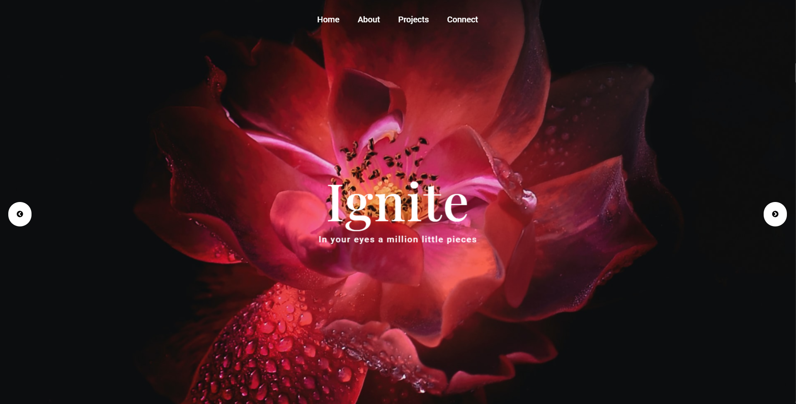

# Pixi and Gsap based web design

*Awesome displacement effect on image and text using displacement map texture*

[template for the project](https://github.com/hmongouachon/rgbKineticSlider)

Use local Server:
- live server or npm live-server

## Credits & Dependencies
Images from [Unsplash](https://unsplash.com/photos/JuesIryw53E)

Images from [Unsplash](https://unsplash.com/photos/gbd6PqRqGms)

Photo by <a href="https://unsplash.com/@ameenfahmy_?utm_source=unsplash&amp;utm_medium=referral&amp;utm_content=creditCopyText">Ameen Fahmy</a> on <a href="https://unsplash.com/@ameenfahmy_?utm_source=unsplash&amp;utm_medium=referral&amp;utm_content=creditCopyText">Unsplash</a>

Photo by <a href="https://unsplash.com/@gavrilovsergphoto?utm_source=unsplash&amp;utm_medium=referral&amp;utm_content=creditCopyText">Sergei Gavrilov</a> on <a href="https://unsplash.com/s/photos/dark-pose?utm_source=unsplash&amp;utm_medium=referral&amp;utm_content=creditCopyText">Unsplash</a>

[PixiJs](http://www.pixijs.com/) 
> Pixi. js is a rendering library that will allow you to create rich, interactive graphic experiences, cross-platform applications, and games without having to dive into the WebGL API or grapple with the intricacies of browser and device compatibility.

[Pixi Filters](https://github.com/pixijs/pixi-filters) 
> Collection of community-authored custom display filters for PixiJS

[Gsap](https://greensock.com/gsap/) 
> The GreenSock Animation Platform (GSAP) is a popular set of JavaScript tools for building animations on the web 

[Google web font loader](https://developers.google.com/fonts/docs/webfont_loader)

[ImageLoaded](https://imagesloaded.desandro.com/)
> ImageLoader. js is an ea cross-platform jQuery image loader plugin which helps load, preload and resize images on your webpage 
